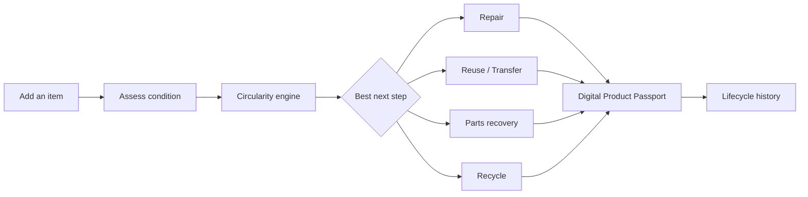
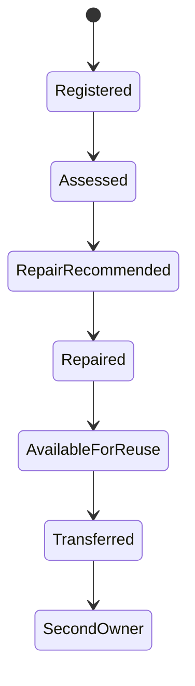
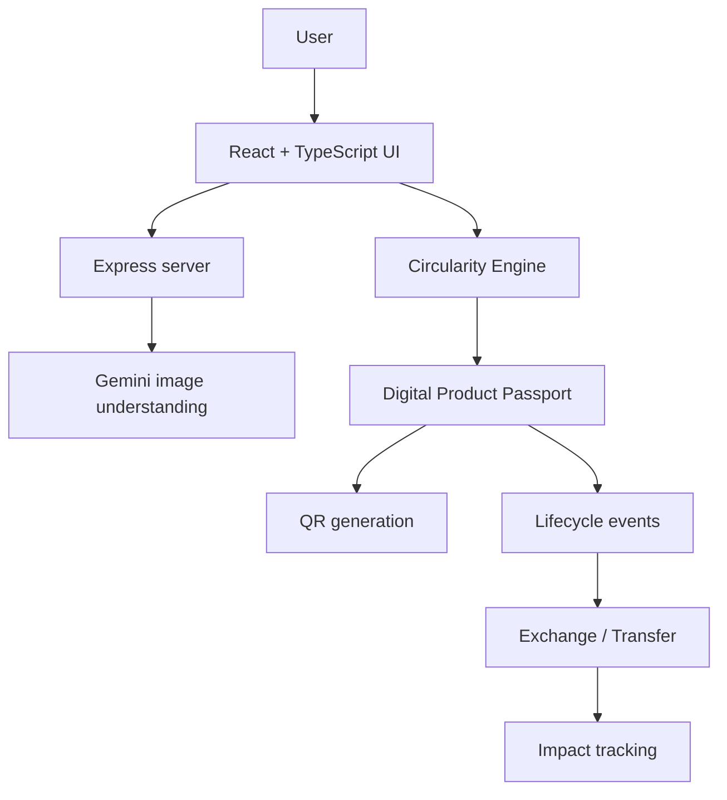
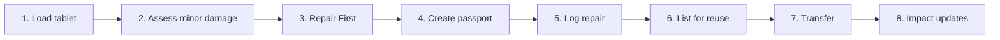

<div align="center">

# ♻️ LOOPLEDGER

### **Give products another life.**

**A QR-powered Digital Product Passport that helps decide whether an item should be repaired, reused, transferred, recovered, or recycled — and keeps its history with the product.**

<br>

[](https://loopledger-sandy.vercel.app/)
[](https://github.com/Nub-programmer/LoopLedger)

<br>


</div>

---

## The problem

A product can still work and still end up as waste.

Sometimes the issue is a loose charging port. Sometimes it is a worn part. Sometimes the owner simply no longer needs it.

The difficult part is often not **“Can this be recycled?”**

It is:

> **“What is the best thing to do with this product next?”**

LoopLedger is built around that question.

---

## What LoopLedger does

LoopLedger helps a user:

- add or photograph an item
- understand its condition
- compare possible next-life actions
- get an explainable circularity recommendation
- create a unique Digital Product Passport
- generate a QR code for that passport
- record repairs, reuse and ownership transfers
- list usable products for exchange
- track estimated circular impact

### The main idea

> **The product keeps its history even when the owner changes.**

---

## Product flow



---

## Circularity Engine

LoopLedger does not ask a language model to make the final sustainability decision.

Gemini can assist with understanding an uploaded product image, while the **final recommendation is generated by an explainable scoring system**.

The engine can consider:

| Factor | Why it matters |
|---|---|
| **Condition** | How damaged or usable the item currently is |
| **Functionality** | Whether it still performs its main purpose |
| **Repairability** | Whether the fault can realistically be fixed |
| **Reuse potential** | Whether another person could continue using it |
| **Product category** | Different products have different recovery paths |
| **Remaining useful life** | Whether extending the product life is worthwhile |
| **Material recovery need** | Whether parts or recycling are becoming necessary |

### Example decision

```text
School Tablet

Repair            ██████████████████  92
Reuse             ███████████████     76
Parts Recovery    █████████           43
Recycle           ████                21

Circularity Score: 87 / 100
Best next step:    Repair First
```

---

## Digital Product Passport

Each registered product gets its own passport.

```text
┌────────────────────────────────────────────┐
│ LOOPLEDGER                                 │
│ DIGITAL PRODUCT PASSPORT                   │
├────────────────────────────────────────────┤
│ Product        School Tablet               │
│ Passport ID    LOOP-7K3M92                 │
│ Condition      Minor Damage                │
│ Score          87 / 100                    │
│ Next Step      Repair                      │
│ Status         In Use                      │
│ QR             Generated per passport      │
└────────────────────────────────────────────┘
```

The passport can record:

- registration
- condition assessments
- repairs
- maintenance
- donation
- reuse
- resale
- ownership transfer
- parts recovery
- recycling

### Lifecycle example



---

## Community Exchange

A useful product should not become waste just because its current owner is finished with it.

LoopLedger allows an item to be marked **Available for Reuse**.

Another user can show interest, and when a transfer happens the event becomes part of the same passport history.

> **Not another marketplace. A way to keep useful products in circulation.**

---

## Architecture



---

## Tech stack

<div align="center">


</div>

The current project uses React, TypeScript, Vite, Tailwind CSS, Express, `@google/genai`, Motion and QR code generation.

---

## Judge demo

The fastest demo path uses a **School Tablet**.



A typical judge demo can show the entire product story in roughly **60–90 seconds**.

---

## Why not just recycle?

Because recycling is only one point in a product's lifecycle.

A better order is:

```text
KEEP USING
    ↓
REPAIR
    ↓
REUSE / TRANSFER
    ↓
RECOVER USEFUL PARTS
    ↓
RECYCLE WHAT REMAINS
```

### **Recycling should be the last step, not the first idea.**

---

## Running locally

### 1. Clone

```bash
git clone https://github.com/Nub-programmer/LoopLedger.git
cd LoopLedger
```

### 2. Install dependencies

With npm:

```bash
npm install
```

or Bun:

```bash
bun install
```

### 3. Add Gemini API key

Create `.env.local`:

```env
GEMINI_API_KEY=your_gemini_api_key
```

Never commit your real API key.

### 4. Start

```bash
npm run dev
```

or:

```bash
bun run dev
```

---

## Useful links

<div align="center">

[](https://loopledger-sandy.vercel.app/)
[](https://github.com/Nub-programmer/LoopLedger)

</div>

---

## Repository activity

<div align="center">


</div>

---

## HackTrack 2026

**Theme:** Responsible Consumption and Production

LoopLedger focuses on:

- extending product lifetimes
- repairing before replacing
- keeping useful goods in circulation
- preserving product history
- making end-of-life decisions easier to understand

It also naturally connects to **Sustainable Cities and Communities** and **Industry, Innovation and Infrastructure**.

---

<div align="center">

# **DON'T THROW IT AWAY YET.**
### **Find its next life.**

<br>

[](https://loopledger-sandy.vercel.app/)

**Built for HackTrack 2026**

</div>
